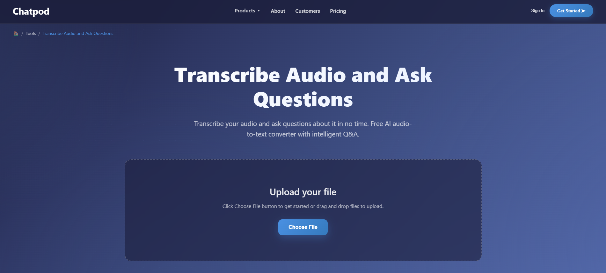
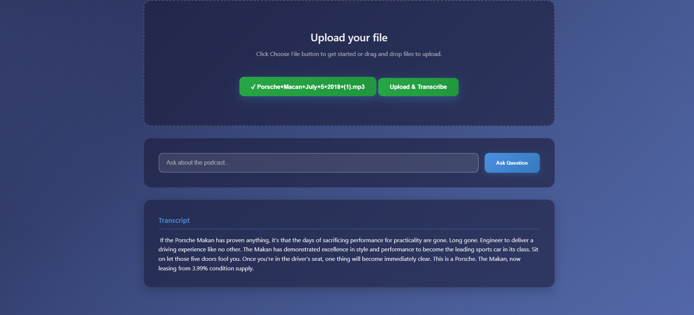

# 🎧 Chatpod: Transcribe Audio and Ask Questions

Chatpod is an intelligent web app that allows users to upload any audio file, automatically transcribe it using OpenAI's Whisper, summarize it with a Transformer model (T5), and ask questions based on the summary using a local LLM (e.g., Mistral via Ollama). Perfect for podcasts, interviews, lectures, voice memos, and more!

---

## 🌟 Features

- 🎙️ Upload any audio file (MP3/WAV).
- ✍️ Automatic transcription using Whisper.
- 📚 Summarization via T5-small model.
- 🤖 Ask questions about the audio using a local LLM (Mistral 7B with Ollama).
- 📦 Stores summaries in ChromaDB vector DB.
- 🌐 Clean and minimal frontend UI.

---

## 📸 Screenshots

### 🖼️ Upload & Transcription



### ❓ Question & Answer Interface



---

## 🛠️ Tech Stack

| Component     | Tool/Library                       |
|---------------|------------------------------------|
| Frontend      | HTML, CSS, JavaScript              |
| Backend       | FastAPI                            |
| Transcription | Whisper (OpenAI)                   |
| Summarizer    | T5-small (via Hugging Face)        |
| Q&A Engine    | Mistral 7B via Ollama              |
| Vector DB     | ChromaDB                           |

---

## 🚀 Getting Started

### 1. Clone the Repository

```bash
git clone https://github.com/your-username/chatpod-transcriber.git
cd chatpod-transcriber
